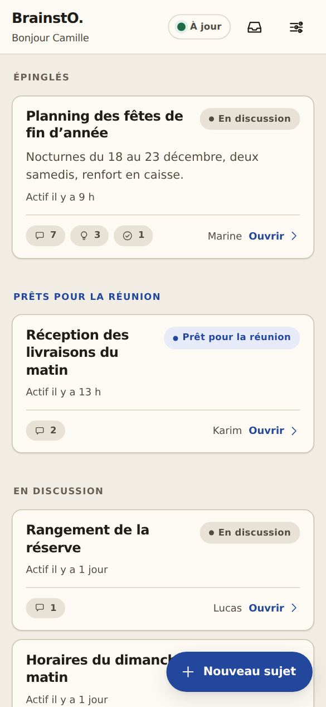
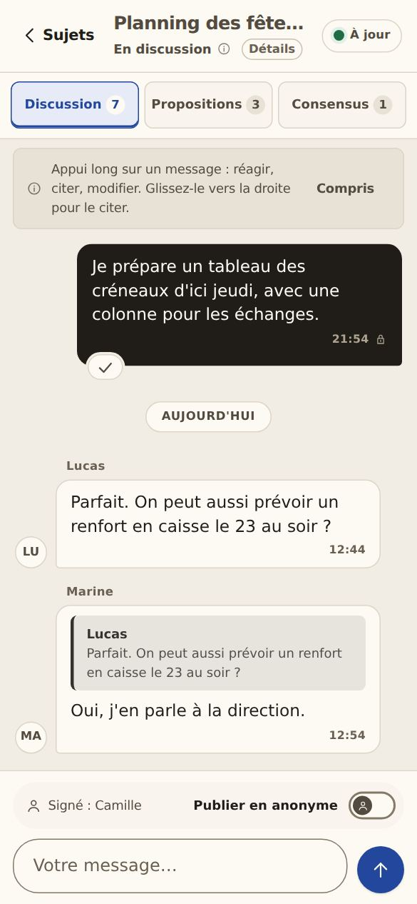
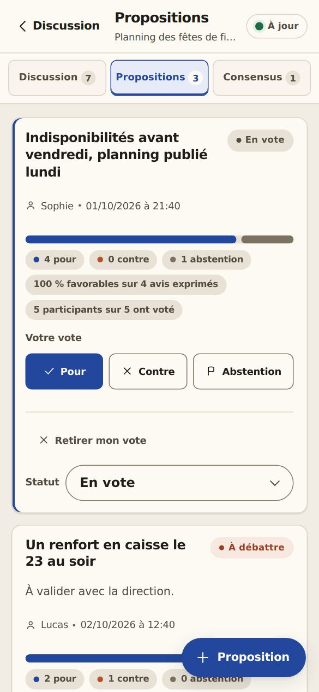
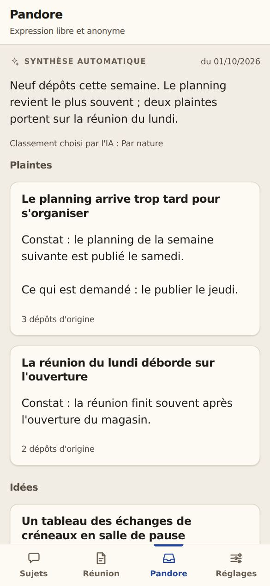
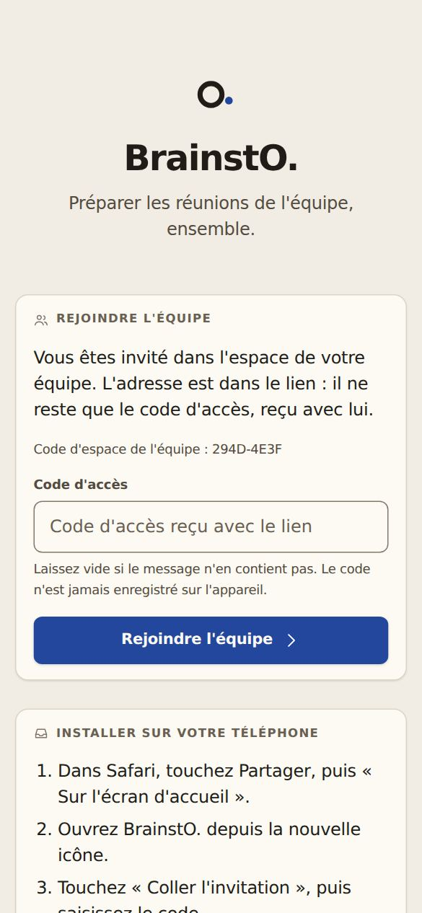

# BrainstO.

**Préparer les réunions de l'équipe, ensemble.**

BrainstO. est l'outil interne de préparation de réunion d'une équipe de magasin.
Chaque point à traiter devient une conversation de groupe ; on en tire des
propositions, on vote, et on arrive en réunion avec un consensus déjà formé. Il
remplace le tableur partagé.

Une application web installable sur iPhone et Android, sans compte à créer, sans
publicité ni service payant : les données restent sur le Google Drive de l'équipe.

| Accueil | Discussion | Propositions | Pandore | Invitation |
|---|---|---|---|---|
|  |  |  |  |  |

<sub>Captures faites avec des données fictives.</sub>

---

## Ce que fait l'application

| | |
|---|---|
| **Navigation** | Trois onglets en bas de l'écran : Discussion, Pandore, Réglages. Discussion a deux vues, **Sujets** et **Réunion**. |
| **Sujets** | Un sujet par point à traiter, classé par avancement : prêt pour la réunion, en discussion, clôturé. Les plus importants s'**épinglent** en tête, pour toute l'équipe. |
| **Discussion** | Un fil de messages par sujet. **Appui long** sur un message pour réagir, copier ou en faire une proposition ; **glisser vers la droite** pour le citer. |
| **Explorer** | Depuis un message, **Explorer cette idée** ouvre un espace d'exploration de cette idée à l'intérieur du sujet : les réponses y restent attachées au message, sans encombrer la discussion, qui n'en montre que le nombre (« 3 réponses »). Un seul niveau. |
| **Anonymat** | Un interrupteur dans la zone d'écriture : le message part signé ou « Anonyme ». Un sujet peut aussi être proposé sans signature. |
| **Propositions** | Pour, contre ou abstention, un vote par personne, modifiable. La barre montre où en est l'équipe. |
| **Consensus** | Chaque sujet se referme sur un consensus ; celui qui arrive en tête sert de repère pour la réunion. |
| **Réunion** | Une synthèse de tous les sujets, prête à projeter ou à imprimer. |
| **Pandore** | Une section à part : la zone d'**expression libre et anonyme**, où l'on dépose ce qui ne se dit pas en réunion (idées, plaintes, questions). Ce n'est pas une discussion : une IA en écrit une **synthèse automatique**, lisible par tous. |
| **Invitation** | Dans les Réglages, un bouton **Partager** : le téléphone propose SMS, mail, WhatsApp… Le lien ouvre l'application déjà réglée sur l'équipe : il ne reste qu'à saisir le code d'accès. |
| **Réglages** | Deux niveaux. Réglages : nom, **apparence** (Auto, Clair, Sombre), invitation, présentation. **Système** : connexion et synchronisation, chaque action y demande une confirmation. |
| **Hors connexion** | L'application s'ouvre sans réseau ; ce qu'on écrit part tout seul au retour de la connexion. |

## Démarrer

**Vous rejoignez une équipe :** ouvrez le lien d'invitation reçu dans Safari (iPhone) ou
Chrome (Android), saisissez le code d'accès écrit dans le message, puis votre prénom.
L'écran explique comment installer l'application. Le détail est dans le
[guide de l'équipe](docs/GUIDE_UTILISATEUR.md).

**Vous installez BrainstO. pour votre équipe :** trois étapes, décrites dans
[`docs/INSTALLATION.md`](docs/INSTALLATION.md).
1. Le serveur, dans Google Apps Script, sur votre compte Google.
2. Le site, publié par GitHub Pages.
3. L'invitation des collaborateurs, depuis les Réglages.

Pandore demande en plus deux secrets : voir [`docs/PANDORE.md`](docs/PANDORE.md).

---

## Pour les contributeurs

Ce dépôt contient le **frontend** et le **backend**.
- Le frontend est un site statique (HTML, CSS, JavaScript, sans framework ni build),
  publié par GitHub Pages et installable comme application (PWA).
- Le backend est un script Google Apps Script : `apps-script/Code.gs`, à copier dans
  l'éditeur.

Tout ce qui suit décrit le fonctionnement interne.

---

## Architecture

| Brique | Où elle vit | Dans ce dépôt ? |
|---|---|---|
| Frontend (PWA) | GitHub Pages | **oui** — c'est ce que Pages sert |
| Backend | Google Apps Script | **oui** — `apps-script/`, à copier dans l'éditeur |
| Données (un fichier JSON) | Google Drive | **non, jamais** |
| Pandore : dépôts anonymes et leur synthèse automatique | `pandore/` | **oui, volontairement** (voir ci-dessous) |
| Secrets (code d'accès, adresse du script) | éditeur Apps Script / appareil | **non, jamais** |

> Le backend a longtemps été tenu hors du dépôt, au motif qu'il porte le code
> d'accès de l'équipe. Il y est entré parce que le code d'accès n'a pas besoin
> d'y être : `ACCESS_CODE` reste **vide** dans le fichier versionné et se
> renseigne dans l'éditeur Apps Script après le collage. Le versionner permet
> ce que la séparation empêchait : `tests/parity.test.js` charge maintenant
> `apps-script/Code.gs` et lui fait passer les mêmes vecteurs qu'au frontend.
> La parité client/serveur n'est plus une relecture à l'œil, c'est un test.
>
> Le `.gitignore` ne masque plus ces deux fichiers (`apps-script/Code.gs` et
> `apps-script/appsscript.json`). Tout autre fichier posé dans `apps-script/` reste
> ignoré par défaut : c'est un garde-fou contre un secret ajouté par mégarde.

Règles tenues par ce dépôt :

- **aucun secret** : ni code d'accès, ni adresse de script, ni jeton, ni
  hachage. Un `ACCESS_CODE` ou un `DATA_FILE_ID` renseigné dans
  `apps-script/Code.gs` fait **échouer les tests** ;
- aucune dépendance externe : pas de npm, pas de CDN, **pas de police distante**
  (typographie 100 % système, donc zéro requête réseau pour l'affichage) ;
- aucune image distante non plus : les icônes sont des SVG construits en
  JavaScript et le grain est un data-URI (voir « Direction artistique »).
- **cibles tactiles** : la règle tenue est WCAG 2.2, critère
  [2.5.8](https://www.w3.org/WAI/WCAG22/Understanding/target-size-minimum.html)
  (taille de cible, minimum : **24 px**). La plupart des commandes atteignent 44 px
  (`--tap`), mais les plus petites (pastilles de réaction, boutons `.btn-sm`)
  mesurent de 24 à 36 px de haut, délibérément (`min-height: 24px`). Ne pas
  promettre « 44 px partout » dans la documentation.

**Une exception, choisie : Pandore.** Ce que l'équipe y dépose anonymement (idées,
plaintes, questions, remarques) est publié chaque jour dans `pandore/depots/`, pour
qu'une IA en écrive la synthèse automatique dans `pandore/synthese.json`, que
l'application affiche. Ce sont les seuls contenus de l'équipe qui entrent dans le
dépôt, et l'application le dit avant chaque dépôt. Fonctionnement, mise en place et
limites de l'anonymat : [`docs/PANDORE.md`](docs/PANDORE.md).

L'adresse du script et le code d'accès sont saisis **par chaque utilisateur dans
l'application**. L'adresse reste dans le `localStorage` de son appareil ; le code
n'est jamais stocké (voir « Verrou » ci-dessous).

---

## Contenu

```
index.html                 coquille de l'application
css/app.css                thème unique, clair et sombre (data-theme, posé par index.html) ; jetons de mouvement
css/motion.css             continuité : appui, calques, apparitions, réponses, repère
js/config.js               constantes (version, rythmes, clés de stockage)
js/utils.js                DOM sûr (texte brut), dates, SHA-256, stockage
js/state.js                modèle de données, validation et réduction des actions
js/database.js             IndexedDB : file d'actions + dernier état connu
js/api.js                  appels au backend (GET révision / état, POST action)
js/sync.js                 synchronisation optimiste, file, indicateur d'état
js/ui.js                   rendu des écrans, feuilles et fenêtres
js/motion.js               continuité : rejoue la différence entre deux rendus (FLIP)
js/app.js                  démarrage, navigation, verrou, actions utilisateur
service-worker.js          hors ligne : précache de la coquille, critique et optionnel
manifest.webmanifest       installation sur l'écran d'accueil
manifest-ios.webmanifest   le même, sans start_url : servi sur iPhone/iPad dans un
                           navigateur, pour que l'icône ouvre l'invitation
assets/icons/              monogramme « O. » (SVG + PNG 192/512/maskable)
docs/IDENTITE_VISUELLE.md  le noyau d'identité : pourquoi le produit est ainsi
docs/MOUVEMENT.md          ce qui bouge, quand, et pourquoi ; ce qui ne bouge pas
docs/                      installation, guide utilisateur, checklist de test
docs/captures/             captures du README (données fictives)
tools/check-contrast.py    relit les jetons du thème et échoue sous le seuil
tools/build-icons.py       régénère les icônes depuis une source unique
tools/pandore-collect.js   collecte quotidienne de Pandore (GitHub Actions)
tools/pandore-check.js     contrôle de ce que l'IA publie dans pandore/
tools/pandore-reset.js     remise à zéro de Pandore, sur demande
pandore/                   Pandore : dépôts bruts, synthèse automatique, registre
.claude/skills/pandore/    procédure de synthèse automatique pour Claude Code
.github/workflows/         tests (test.yml) et collecte de Pandore (pandore.yml)
apps-script/Code.gs        backend : stockage Drive, verrou, dédup, protocole
apps-script/appsscript.json manifeste du projet Apps Script
tests/parity.test.js       parité client / backend, action par action
tests/sync.test.js         deux clients face à un faux backend (réception, file)
tests/session.test.js      verrou par inactivité : quand l'ouverture exige le code
tests/onboarding.test.js   présentation initiale : qui la voit, qui y échappe
tests/navigation.test.js   contrat du geste retour : profondeurs déclarées, point
                           de passage unique
tests/branches.test.js     Explorer : modèle, validation, normalisation, écran,
                           compteur, brouillons, anonymat
tests/motion.test.js       contrat du mouvement : jetons, repli, aucune boucle ni
                           dépassement, couche de continuité sans effet sur le focus
```

---

## Direction artistique

Le parti pris tient en une phrase, et tout le fichier de style en découle :

> **La couleur ne dit qu'une chose : où en est l'accord.**
> Froid = ce sur quoi l'équipe converge. Chaud = ce qui diverge encore.
> Tout le reste — cartes, bulles, texte, séparateurs — est en neutre.

Les jetons sont en tête de [`css/app.css`](css/app.css) ; le raisonnement, la
matière dont il est tiré et les territoires écartés sont dans
[`docs/IDENTITE_VISUELLE.md`](docs/IDENTITE_VISUELLE.md). Les deux ne se
recopient pas : l'un porte les valeurs, l'autre les raisons.

> Ce registre — « deux voix qui convergent » — a remplacé le précédent, un
> chrome neutre à accent teal unique, en version 1.12.0. Le précédent n'avait
> aucun défaut : il était accessible, cohérent, et il se faisait oublier pendant
> qu'on travaillait dedans. C'était exactement le problème. Il était aussi
> transposable tel quel à n'importe quel outil d'équipe — **sans faute ne veut
> pas dire reconnaissable**, et une interface qui pourrait habiller quatre
> produits sans rapport n'appartient à aucun des quatre.

### Ce que la couleur signifie

BrainstO. sert à faire converger des positions divergentes. C'est la seule chose
que le produit fait, donc c'est la seule chose que la couleur dit. Deux teintes,
un sens chacune, et rien d'autre :

| Teinte | Ce qu'elle signifie | Où elle apparaît |
|---|---|---|
| **L'accord** — bleu d'encre | ce sur quoi l'équipe converge | vote « pour » · proposition retenue · sujet prêt pour la réunion · Consensus · point du monogramme · et le chrome, parce que le chrome sert à produire cet accord |
| **La voix** — terre cuite | ce qui diverge encore | vote « contre » · proposition en débat. **Jamais ailleurs** |

La conséquence se lit sans lire un mot : sur un sujet qui a convergé, **le chaud
a disparu de l'écran**. La convergence n'est pas décrite par un libellé, elle est
visible par soustraction. C'est la signature principale du produit.

Deux règles la protègent, et ce sont elles qui font le travail :

- **Un seul aplat coloré par surface.** Hors barre de vote, une seule des deux
  teintes est dépensée en aplat sur une même surface ; l'autre ne peut y
  apparaître qu'en trait ou en encre. Sans cette règle, la bi-teinte se lit comme
  une décoration dès que l'écran devient dense. La barre de vote est la **seule**
  exception, et c'en est la raison d'être : c'est le seul endroit où la divergence
  est une quantité, donc le seul où les deux teintes doivent se comparer côte à
  côte.
- **Deux couches chromatiques disjointes.** La couche de délibération n'emploie
  que les deux voix et le neutre. La couche technique — synchronisation, erreur,
  action destructive — n'emploie que le vert, le carmin et l'ocre, et n'emploie
  jamais les deux voix. Pas de vert « pour », pas de rouge « contre », pas d'ocre
  « en débat ». C'est ce qui fait que cinq teintes ne sont pas une dispersion ;
  si la séparation se relâche, elles en redeviennent une.

Un corollaire qui surprend et qui se défend : **une proposition écartée n'est pas
une erreur**. Elle est neutre, pas rouge — le rouge appartient à la couche
technique, et une équipe qui tranche contre une option n'a rien fait de mal.

### L'échelle de neutres

Douze paliers de **grège chaude** (teinte ~40°, chroma volontairement basse), et
la température est une décision : le produit est fait de texte écrit par l'équipe
et il a remplacé un tableur partagé. C'est le registre du document, pas celui du
verre. C'est aussi ce qui fait que le bleu se lit comme le **seul élément froid**
de l'écran — un accent froid sur une assiette froide ne crée aucune tension, et
c'est ce qui arrivait avant.

Les paliers ne sont pas choisis à l'œil : chacun est **construit puis vérifié par
ratio de contraste**, dans les deux modes, et sur les quatre fonds où il peut
apparaître — surface, canvas, surface creuse, feuille. Le contrôle qui ne trouve
jamais rien est celui qu'on ne fait que sur le fond principal.

| Rôle | Clair | Sombre | Ratio le plus défavorable |
|---|---|---|---|
| Surface (`--n-0`) | `#FDFAF4` | `#1C1915` | — |
| Fond (`--canvas`) | `#F2EDE4` | `#0F0D0B` | — |
| Texte | `#201C17` | `#EEEAE3` | 13,1:1 · 13,6:1 |
| Texte secondaire (`--muted`) | `#534B40` | `#B3AA9C` | 6,7:1 · 7,3:1 |
| Texte tertiaire (`--faint`) | `#695F52` | `#9A9082` | 4,9:1 · 5,4:1 |
| Bord de champ (`--line-field`) | `#827969` | `#78705F` | 3,3:1 · 3,4:1 |
| Filet décoratif (`--line`) | `#DCD5C7` | `#2B2721` | — |

**Le palier 0 n'est pas blanc**, et c'est la seule chose de cette échelle qui se
remarque avant d'être expliquée. Un blanc pur posé sur une assiette chaude ne se
lit pas comme du papier : il se lit comme un trou froid découpé dedans, et il
ramène le registre clinique que l'échelle existe pour quitter. Toute la plaque
claire descend donc d'un cran — c'est le **rapport** entre `--surface` et
`--canvas` qui détache une carte, pas la clarté absolue de la carte. L'encre
posée sur un aplat (`--on-accord`, `--on-voix`, `--on-danger`) est ce même papier
et non du blanc pur, pour la même raison.

Deux jetons portent la conformité et ne doivent pas être confondus :
`--line` **habille** (filets, séparateurs — aucune information n'en dépend)
tandis que `--line-field` **délimite** : il dessine le bord des champs et des
contrôles, et tient seul le seuil de 3:1 exigé par le critère WCAG 2.2
[SC 1.4.11](https://www.w3.org/WAI/WCAG22/Understanding/non-text-contrast.html)
— seuil dont la spécification précise qu'il **ne s'arrondit pas** : 2,999:1 ne
passe pas.

### Les deux voix, en valeurs

**Deux jetons par teinte, pas un.** `--accord` est l'accord **en trait** —
contour de focus, bord de champ actif, liseré, point du monogramme.
`--accord-surface` est l'accord **en aplat** — bouton principal, FAB, pastille.

| | Clair | Sombre |
|---|---|---|
| `--accord` (trait) | `#23479C` | `#8FB2F2` |
| — sur la surface | 8,56:1 | 7,60:1 |
| `--accord-surface` (aplat) | `#23479C` | `#2A4D9E` |
| — encre posée dessus (`--on-accord`) | `#FFFFFF` — 8,56:1 | `#EEEAE3` — 6,60:1 |
| — encre secondaire (`--on-accord-soft`) | `#CCD7F0` — 5,93:1 | `#B8C9EE` — 4,76:1 |
| `--voix` (trait et encre) | `#9A3F22` | `#E0906A` |
| `--voix-strong` (le seul aplat qu'elle se permet) | `#B4522C` | `#E0906A` |

En mode clair les deux jetons d'accord coïncident ; en mode sombre non, et c'est
tout l'intérêt de les avoir séparés. Un bleu assez lumineux pour se lire **en
trait** sur du noir devient une lampe une fois **étalé** sur la largeur d'un
bouton. L'aplat descend donc là où le trait monte. La terre cuite, elle, ne porte
jamais de texte : elle n'a qu'une valeur claire en mode sombre.

> Les segments de la barre de vote ont leurs jetons propres (`--vote-accord`,
> `--vote-voix`, `--vote-abstention`) plutôt que de réemployer l'aplat d'accord.
> En mode sombre, un segment doit être **clair** pour tenir 3:1 sur le fond de la
> barre, alors que le bouton principal doit rester **sombre** pour porter du
> texte clair. Les deux besoins divergent, donc les deux jetons se séparent.

**« Mes » messages sont la seule bulle pleine du fil, et elle est pleine
d'encre — pas d'accord.** C'est le point où le parti pris se paie : « c'est moi
qui ai écrit ça » n'est pas une information d'accord, et un bleu ici dirait la
même chose qu'un bleu sur le Consensus. L'information reste portée deux fois —
remplissage **et** alignement à droite — donc elle ne dépend ni de la couleur ni
d'une seule dimension.

### La vérification n'est plus une relecture

```bash
python3 tools/check-contrast.py
```

Le script lit les jetons de `css/app.css` — il ne les recopie pas, sans quoi il y
aurait deux vérités —, résout les `var(--…)` et les `rgba()` posés sur leur fond
réel, et **échoue sous le seuil**. Quarante-neuf couples par mode, quatre-vingt-dix-huit
au total : texte courant, texte secondaire, horodatages, encres posées sur un
aplat, pastilles sur leur fond pâle, bords de champ, contours de focus, segments
de vote, pastilles de synchronisation. Bibliothèque standard uniquement, et la CI
l'exécute à chaque poussée.

Le bloc des jetons sombres que le script lit est `@media screen and
(prefers-color-scheme: dark)` (il accepte aussi la forme sans `screen and`) : le thème
sombre ne vaut que pour l'écran. La synthèse imprimée garde donc toujours la palette
claire, même depuis un appareil en thème sombre.

C'est ce qui manquait : la phrase « tous les couples ont été vérifiés au ratio »
vieillissait à chaque modification de jeton, parce qu'elle reposait sur une
relecture à l'œil.

### Surfaces, élévation, rayons

| Élément | Valeur | Pourquoi ici |
|---|---|---|
| Fond | `#F2EDE4` le jour, `#0F0D0B` la nuit | fond teinté, surfaces de papier par-dessus : c'est ce rapport qui détache une carte, pas une ombre |
| Élévations | **deux**, `--shadow-1` et `--shadow-2` | une par empilement réel. Le niveau 2 est réservé à ce qui flotte : feuilles, fenêtres, FAB, bandeau |
| Rayons | 12 px cartes · 10 px · 8 px champs · 6 px · pastilles | trois valeurs cohérentes par niveau. Un rayon généreux adoucit tout, y compris les défauts d'alignement |
| Flou | deux surfaces, pas une de plus | barre collante et feuilles — les seules qui passent réellement au-dessus d'un contenu qui défile |
| Espacements | rapport **6 / 14 / 26** | intra-champ, inter-blocs, inter-sections. C'est le rapport qui fait lire les groupes, pas la valeur absolue |
| Typographie | système, échelle fluide (`clamp`), cinq tailles | la hiérarchie passe d'abord par la **graisse**, ce qui préserve la densité |

La typographie mérite sa ligne, parce que c'est la dimension qu'on aurait
normalement fait porter l'écart : elle est le meilleur rapport qualité-prix des
sept dimensions possibles. Elle est ici **hors jeu**, et pour une raison
antérieure à toute considération esthétique — la règle « zéro requête réseau »
interdit toute police distante, et une famille système varie trop d'un appareil à
l'autre pour porter une identité. C'est aussi pourquoi l'écart est dépensé sur la
couleur : la contrainte a décidé avant nous.

Le thème sombre n'est pas l'inverse du clair : les valeurs y sont
**recalculées**. Le rapport s'y inverse — le fond est le palier le plus sombre
et les surfaces remontent, là où le clair a un fond teinté et des surfaces
de papier. L'élévation passe par la luminosité de la surface, parce que sur du
`#0F0D0B` une ombre diffuse ne fait flotter personne quel que soit son alpha :
l'ombre n'y élève plus, elle ancre. Un sombre chaud est le réglage le plus
délicat du fichier — trop teinté il vire au sépia, pas assez il redevient
l'ardoise qu'on vient de quitter —, donc la chroma des neutres y est plus basse
qu'en clair, à teinte égale. **Le clair reste le mode de conception** : c'est lui
qui est lu en magasin, en plein jour, et c'est là que les défauts de hiérarchie
se voient.

Enfin, chaque statut porte **une couleur et une forme** (pastille, icône,
libellé), de sorte qu'aucune information ne repose sur la teinte seule — y
compris la barre de vote, doublée par sa légende et par ses compteurs.
### Mouvement

La règle est la **fréquence** : plus une action est répétée, plus son animation
doit être courte ou absente. Une transition de 400 ms vue cent fois par jour est
une taxe, pas un agrément — et la démonstration montre la première occurrence
quand l'utilisateur vit la centième.

| Ce qui bouge | Durée | Fréquence de vue |
|---|---|---|
| Retour à l'appui, survol | 100 ms | plusieurs fois par minute |
| Révélation des cartes à l'arrivée sur un écran | 220 ms, 8 px, décalage 18 ms **plafonné à six crans** | plusieurs fois par jour |
| Feuille, fenêtre | 240 ms à l'ouverture, plus court à la fermeture | quotidien |
| Message envoyé ou reçu, vote, réaction, carte ajoutée ou retirée | 160 à 220 ms, **depuis l'ancien état** | plusieurs fois par jour |
| Changement d'écran | 240 ms ; barres immobiles, seuls le contenu et le trait de position bougent | plusieurs fois par jour |
| **Séquence d'accueil** | 1060 ms, en quatre temps | une fois par ouverture |
| Arrivée de la présentation initiale | 240 ms le voile, 220 ms la carte, chevauchés | une fois par appareil |
| Changement de panneau de la présentation | 100 ms, **opacité seule** | quatre fois en trente secondes |

La cascade de révélation passait de 550 ms, 36 px et un changement d'échelle, à
45 ms de décalage **sans plafond** : la trentième carte d'une longue liste
attendait 1,4 s pendant que l'utilisateur, lui, avait déjà commencé à défiler.

#### La séquence d'accueil

C'est le seul geste expressif de l'application, cantonné aux deux écrans vides —
accueil et verrou. Il n'est vu **qu'à l'ouverture**, ce qui est la condition pour
qu'une séquence de cette longueur reste supportable : la même animation sur un
bouton serait interdite par la règle ci-dessus. Il ne retarde rien — sur l'écran
de verrou, le champ de code est saisissable dès le premier rendu.

Ce qu'il raconte : **un tour de table**, en un peu moins de trois secondes.

| | Quand | Ce qui se passe | Ce que ça dit |
|---|---|---|---|
| 1 | 450 → 2050 ms | le trait fait le tour de l'anneau à vitesse constante, depuis midi | le tour de table |
| 2 | 0 → 1830 ms | quatre idées arrivent du large, chacune vers sa place, et s'y fondent **à l'instant où le trait passe** | chacun son tour |
| 3 | 2050 → 2250 ms | rien ne bouge | la délibération |
| 4 | 2250 → 2650 ms | un point unique apparaît à côté et « atterrit » | la décision qui en sort |
| 5 | 2150 → 2650 ms · 2550 → 2950 ms | le logotype monte d'un bloc, puis la signature se révèle | — |

La séquence tenait auparavant en une seconde : tout s'y chevauchait, et on ne
voyait qu'un éclair. Ce rythme est celui d'une ouverture, vue une fois par
session — jamais celui de l'interface, qui reste sous 300 ms.

Le trait est **linéaire** : un tour de table donne le même temps à chacun, et une
courbe qui freine tasserait les dernières places. C'est aussi ce qui rend le
rendez-vous calculable : chaque idée porte sa place (`--catch`, fraction du tour)
et `css/app.css` en déduit son départ. Toute la chorégraphie dérive de cinq
valeurs posées sur `.hero` (`--mark-*`) ; changer la durée du tour garde les
rendez-vous justes. Le point (4) et le logotype (5) se terminent **sur le même
instant**, et le silence (3) est la seule pause du thème : sans lui, la décision
sortait du cercle comme une conséquence mécanique du tracé.

Un rendu de synchronisation tombé pendant la séquence la **reprend** où elle en
était : les écrans du monogramme ont une fenêtre de reprise de 3400 ms
(`HERO_WINDOW_MS`, `js/ui.js`), les autres gardent 1400 ms.

Trois décisions moins évidentes :

- **Les quatre idées n'appartiennent pas à la marque.** Elles n'existent que
  pendant l'animation : au repos leur opacité est nulle, et elles finissent sous
  le trait, de sa couleur. Sans mouvement elles ne s'affichent jamais, et le
  monogramme reste l'anneau et son point.
- **Elles accélèrent au lieu de freiner** (`--ease-in`, la seule occurrence du
  fichier) : une idée attirée par sa place, pas posée dessus. Avec la courbe
  amortie du reste du thème, elles parcouraient presque tout le trajet au début
  puis stagnaient, et on ne voyait plus d'arrivée.
- **La signature est animée**, alors qu'elle ne l'était pas. Immobile, elle
  s'affichait dès la première image et restait seule sous un logo en train de se
  dessiner, à annoncer un nom pas encore arrivé. Un élément non animé au milieu
  d'une séquence n'est pas neutre : il la contredit.

Et trois points d'implémentation :

- Le monogramme est construit en **SVG inline** par `Utils.logoMark` : un anneau
  en `border` ne sait pas se tracer, un trait SVG oui (`stroke-dashoffset`). Le
  cercle est tourné de -90° pour que le tracé parte du haut — sans quoi un
  `<circle>` commence à 3 h et le geste devient illisible. Cette rotation tourne
  autour du centre de l'anneau, en unités utilisateur : en `50% 50%`, elle
  tournait autour du centre du viewBox et décalait l'anneau par rapport à l'icône.
- Les bouts du trait sont **droits**, seul écart au jeu d'icônes : le tiret vaut
  exactement une circonférence, et des bouts arrondis se recouvriraient d'un
  demi-trait une fois le cercle refermé, laissant un épaississement en haut.
- Les origines de transformation sont en **unités utilisateur**, pas en
  pourcentage : un pourcentage exigerait `transform-box: fill-box` pour être
  juste, et se résoudrait sinon contre le viewBox entier.

Le mouvement est en **CSS**, sans bibliothèque. Une bibliothèque d'animation
aurait été une dépendance distante de plus, contre la règle du dépôt, pour des
transitions de propriétés que le navigateur sait déjà interpoler. Seule
exception, sans dépendance : la couche de continuité (`js/motion.js`) pilote
quelques animations par l'interface native du navigateur (`Element.animate`),
parce que leurs valeurs de départ ne sont connues qu'à l'exécution.

#### La continuité

Le rendu reconstruit l'écran et le calque à chaque appel : sans précaution, une
feuille ouverte **rejouait son entrée** à chaque donnée reçue, et tout changement
d'état sautait d'une image à l'autre. `js/motion.js` relève l'avant, laisse le
rendu se faire, puis rejoue la différence sur les nœuds neufs (FLIP pour ce qui
se déplace, une classe « depuis l'ancien état » pour le reste). Les niveaux, les
jetons, la carte complète « action → mouvement » et ce qui n'est volontairement
pas animé : [`docs/MOUVEMENT.md`](docs/MOUVEMENT.md).

#### La présentation initiale

À sa première entrée effective dans l'espace, un nouvel arrivant voit l'application
se présenter en cinq panneaux — les cinq parties, dans l'ordre où on les traverse.
Le cadrage complet, la détection de la première connexion et le plan-séquence sont
dans [`docs/ONBOARDING.md`](docs/ONBOARDING.md) ; ne sont retenus ici que les trois
points qui touchent le mouvement et la structure de l'application.

**Le calque vit hors du cycle de `UI.render`.** C'est la décision qui tient tout le
reste. `UI.set` incrémente `UI.local.version`, qui entre dans `signature()` : si
l'étape courante y vivait, chaque « Suivant » reconstruirait `#app`, perdrait le
focus, et recréerait la région d'annonce **avec** son contenu — or une région live
insérée en même temps que son texte n'annonce rien. Le calque mute donc son propre
sous-arbre, comme `UI.refreshStatus`, et ses nœuds de commande ne sont jamais
recréés.

**C'est un `<dialog>` ouvert par `showModal()`.** Le voile est son `::backdrop`
natif — donc aucune couche plein écran de plus, ce que le retrait de l'aura et du
grain interdisait — et le piège de focus comme l'inertie de l'arrière-plan viennent
de l'élément lui-même, sans bibliothèque. L'appel est **gardé** : `compat-scan`
donne à `showModal()` un plancher WebKit 15.4 et un mode d'échec `throws`, or iOS
15.0 → 15.3 est en tier B, où une perte de fonction est interdite. Sans garde, la
séquence lèverait une exception sur cette sonde ; avec, elle retombe sur une carte
non modale.

**Deux régimes de mouvement, pas un.** L'arrivée est vue une fois : elle a droit à
un geste. La transition entre panneaux est vue quatre fois en trente secondes : elle
tient en 100 ms, et **en opacité seule**. Ce dernier point n'est pas une économie —
le critère d'accessibilité sur le mouvement ne vise que le déplacement et le
changement de taille, donc un fondu d'opacité en sort du champ. On n'atténue pas le
risque, on le supprime. Et le voile ne se refond jamais entre deux panneaux : c'est
le seul repère fixe de la séquence.

L'invariance du repli est **vérifiée** par `tests/onboarding.test.js`, qui lit
`css/app.css` : toute animation de la séquence doit vivre dans un bloc
`no-preference`, aucune règle en dehors ne doit poser un état masqué, et le fondu du
voile doit être porté par la classe d'arrivée — sinon il rejouerait à chaque étape.

#### Une entrée survit à un nouveau rendu

Le rendu **détruit et reconstruit** le nœud de l'écran à chaque appel. La classe
`screen--enter`, posée au seul changement d'écran, était donc perdue dès qu'un
second rendu suivait — ce qui arrivait systématiquement au démarrage :
`Sync.boot()` résout, appelle `UI.force()`, et le second rendu arrivait une
milliseconde après le premier. **Aucune animation d'entrée n'était visible sur
l'écran de connexion**, ni le logotype, ni la cascade des cartes.

`UI.render` mémorise désormais l'**instant** de l'entrée. Tant que la fenêtre
est ouverte (`ENTER_WINDOW_MS`, 1400 ms), un rendu qui retombe au même endroit
repose la classe et publie le temps écoulé dans `--enter-elapsed`, que
`app.css` retranche de chaque délai. Un délai négatif démarre l'animation en
cours de route : elle **reprend** au lieu de recommencer — ce qui serait un
clignotement — et de disparaître.

`Utils.now()` s'appuie sur `performance.now()` et non `Date.now()` : l'heure
système peut reculer, et un écart négatif ferait passer une animation pour
terminée.

#### Le repli

**L'état au repos du balisage est l'état final.** Sans animation — préférence de
mouvement réduit activée, ou moteur qui ignore la requête — le monogramme est
complet et bien placé. C'est le mode de panne à ne jamais produire : un logo
figé à moitié tracé, sans message d'erreur.

Cette invariance est vérifiée, pas supposée. Sous `prefers-reduced-motion:
reduce` : `stroke-dashoffset` vaut `0px` et `stroke-dasharray` `none` (anneau
complet), le point et le logotype sont à `transform: none` et `opacity: 1`, et
les quatre points de convergence restent à opacité nulle — un décor ne doit pas
se figer à l'écran, il doit ne pas s'y afficher.

### Icônes d'application et écran de démarrage

Les quatre icônes sont **générées**, pas dessinées à la main :
[`tools/build-icons.py`](tools/build-icons.py) les produit depuis une source
unique, en Python standard — le dépôt interdit toute dépendance, et l'icône
n'est qu'un aplat plus deux cercles.

```
python3 tools/build-icons.py
```

Ce script existe pour un défaut précis, et invisible sur toute maquette.
L'écran de démarrage d'une application installée est composé par le système :
il peint le `background_color` du manifeste, puis pose l'icône par-dessus. Si
le fond de l'icône n'est pas **exactement** `background_color`, un disque se
découpe au milieu de l'écran. C'est ce qui se produisait — fond `#031C25`,
icône `#01161E` — et il faut installer l'application pour le voir.

Le script **refuse de générer** si les deux valeurs divergent. C'est le seul
couplage du fichier, et il est vérifié à l'exécution plutôt que confié à la
vigilance.

> Sur un téléphone où l'application est déjà installée, l'écran de démarrage
> peut rester l'ancien un moment : Android conserve le manifeste et les icônes
> jusqu'à ce que le service worker se renouvelle. Désinstaller puis réinstaller
> est le seul moyen sûr de le rafraîchir immédiatement.

### Icônes et réactions

Aucune police d'icônes : `Utils.icon(nom, taille)` construit un SVG en trait
(1,7 px, bouts arrondis, `currentColor`). Rendu identique partout, contrairement
aux emoji dont le dessin change d'un système à l'autre.

Les réactions restent **stockées sous forme d'emoji** (`Core.REACTIONS`, validée
à l'identique par le backend) mais elles sont **affichées** comme des marques
dessinées (`Utils.reactionMark`), accompagnées de leur libellé :

| Valeur stockée | Marque | Libellé |
|---|---|---|
| `👌` | coche | D'accord |
| `💪` | éclair | Je m'engage (retirée de l'interface, voir plus bas) |
| `🤏` | onde | Mitigé |
| `👎` | croix | Pas d'accord |
| `💩` | sens interdit | À écarter |

À 22 px, une main dessinée est illisible : on traduit donc l'intention, pas le
geste. Une valeur inconnue (donnée écrite par une version différente) retombe
sur l'emoji brut.

> `🤞` a été retiré du jeu. **La même liste doit être appliquée dans le script
> Apps Script** — sinon un appareil resté sur l'ancienne version peut encore
> écrire cette réaction. Elle est alors ignorée à la lecture : elle disparaît de
> l'affichage, sans jamais être convertie vers une autre réaction.

> `💪` (« Je m'engage ») est retirée **de l'interface seulement** : elle n'est plus
> proposée ni affichée (`RETIRED_REACTIONS`, dans `js/ui.js`). Elle reste dans
> `Core.REACTIONS` et dans le backend : les données déjà écrites restent valides,
> et le script Apps Script n'a pas à être redéployé.

## Synchronisation : écriture par actions

Le frontend n'écrit **jamais** le JSON complet. Il envoie des actions précises
(`CREATE_MESSAGE`, `SET_VOTE`, …) que le backend applique sur la dernière
version. Deux personnes qui écrivent en même temps ne s'écrasent donc pas.

- `GET ?mode=revision` → `{revision, updatedAt}` — léger, appelé en boucle ;
- `GET ?mode=state&since=N` → `{unchanged:true}` si la révision vaut encore `N`,
  sinon l'état complet **dans la même réponse** ;
- `POST` (corps = une action, **ou un tableau d'actions**) →
  `{ok, revision, state, results}`.

### Capacités négociées

Le frontend et le backend se déploient séparément — GitHub Pages d'un côté,
Apps Script de l'autre, et des téléphones qui gardent longtemps une version en
cache. Exiger une mise à jour simultanée était donc intenable.

Chaque réponse du serveur porte un champ `features`, et le client n'emprunte un
raccourci qu'une fois celui-ci annoncé :

| Capacité | Ce qu'elle change |
|---|---|
| `since` | lecture conditionnelle : **une** requête au lieu de deux pour recevoir un message |
| `batch` | un `POST` peut porter jusqu'à 20 actions, avec un verdict par action |
| `lean` | l'état envoyé n'emporte plus `processedActionIds` — **un tiers du poids** |
| `pins` | épingler un sujet pour toute l'équipe (`SET_TOPIC_PIN`) |
| `ideas` | déposer dans Pandore (`SUBMIT_IDEA` ; noms d'avant Pandore) |
| `branches` | explorer un message (`CREATE_MESSAGE` avec `branchRootId`) — voir ci-dessous |

Un serveur d'avant n'annonce rien : le client retombe sur le protocole
d'origine. Un client d'avant ignore le champ : le serveur récent lui répond
comme avant. Les deux sens de désaccord sont couverts par `tests/sync.test.js`.

**`branches` est une garde, pas un raccourci.** Un `Code.gs` antérieur à
`brainsto-backend-1.3.0` accepterait un message d'exploration et **perdrait son
rattachement en silence** : la réponse tomberait dans la discussion principale.
Tant que le serveur n'annonce pas `branches`, « Explorer cette idée » reste donc
visible mais grisé, avec sa raison, et aucun message d'exploration n'est mis en
file. En mode local, la fonctionnalité est disponible d'emblée. Pour l'ouvrir à
l'équipe : recopier `apps-script/Code.gs` dans l'éditeur, puis **Déployer →
Gérer les déploiements → Modifier → Version : Nouvelle** (voir
[`docs/INSTALLATION.md`](docs/INSTALLATION.md)). Modèle et compatibilité :
[`docs/MODELE_DONNEES.md`](docs/MODELE_DONNEES.md), « Explorer un message ».

#### Retour arrière après le backend 1.3.0

Trois scénarios, à ne pas confondre. Appliquer le premier qui suffit.

**Scénario 1 — Problème côté application (frontend).**

- Revenir sur le changement applicatif sur `main` (commit d'annulation), publié
  comme une nouvelle version : `APP_VERSION` et `CACHE_VERSION` incrémentés
  ensemble (README, « Publier une nouvelle version »).
- **Conserver le backend 1.3.0** en service. Ne pas recopier `Code.gs` depuis
  `main` après l'annulation : le dépôt reviendrait à un `Code.gs` antérieur, et le
  déployer ferait passer au scénario 2.
- **Aucune restauration de données.**
- **Aucune perte** : messages, votes, consensus et explorations restent intacts,
  car le backend 1.3.0 sert aussi les anciennes versions de l'application. Seul
  effet visible : une application qui ne connaît pas `branchRootId` affiche les
  réponses d'exploration dans le fil principal. Leur rattachement reste dans les
  données et réapparaît avec une version qui le connaît.

**Scénario 2 — Retour forcé vers un backend antérieur à 1.3.0.**

- **D'abord**, exécuter `backupNow()` dans l'éditeur Apps Script. La copie
  `brainsto-data.json.manuel.<date>` est un instantané récent : elle contient
  toutes les données actuelles et les `branchRootId`.
- **Seulement ensuite**, redéployer l'ancien backend.
- L'ancien backend ne comprend pas `branchRootId`. Dès son déploiement, il sert un
  état sans ces rattachements : les réponses d'exploration s'affichent dans le fil
  principal. Il réécrit l'état complet à chaque enregistrement : la première action
  enregistrée supprime donc ces rattachements du fichier de données, pour tous les
  messages. Les textes restent.
- Pour retrouver les rattachements : redéployer le backend 1.3.0, puis
  `restoreFromBackup` sur la copie `manuel`. Les écritures faites entre cette copie
  et la restauration sont alors perdues.

**Scénario 3 — Dernier recours : la copie `avant-brainsto-backend-1.3.0`.**

- Le backend 1.3.0 la dépose automatiquement juste avant sa première écriture
  (`brainsto-data.json.avant-brainsto-backend-1.3.0.<date>`). Elle représente
  l'**état antérieur au déploiement 1.3.0**.
- La restaurer ramène **TOUT l'état partagé** à cette date. Elle peut donc
  supprimer **tous** les messages, votes, consensus, explorations et autres
  écritures créés depuis, pas seulement les explorations.
- À n'utiliser que si les scénarios 1 et 2 ne suffisent pas, par exemple des
  données abîmées sans copie plus récente utilisable. `restoreFromBackup` garde
  l'état remplacé dans une copie `avant-restauration`, mais ne le refusionne pas.

Mesuré sur un fil de 60 messages :

| | backend d'origine | backend redéployé |
|---|---|---|
| Recevoir un message | 2 requêtes | **1** |
| Cinq réactions enchaînées | 5 `POST` | **1** |
| Poids d'un état téléchargé | 57,6 ko | **38,6 ko** |

### Rythme adaptatif

Le rythme d'interrogation n'est pas fixe : il suit l'activité réelle
(`CONFIG.POLL_*`).

| Régime | Cadence | Quand |
|---|---|---|
| Nerveux | 1,8 s | pendant les 90 s qui suivent une écriture — la sienne ou celle d'un autre |
| Repos | 6 s | personne n'écrit ; passage direct de 1,8 s à 6 s quand la fenêtre de 90 s se ferme, sans rampe |
| Arrière-plan | 60 s | onglet masqué |
| Recul | ×2 par échec, plafond 60 s | le réseau ou le serveur ne répond pas |

Une cadence fixe de 3 s était le pire des deux mondes : 1 200 requêtes par
heure et par personne, chacune relisant le fichier Drive côté Apps Script (les
écritures, elles, sont sérialisées derrière un `LockService` ; les lectures ne
prennent pas le verrou), et malgré ce coût une réception toujours en retard d'un
tour de boucle.

Le repos reste volontairement **court** (6 s) : c'est lui qui plafonne l'attente
du *premier* message après un silence, le seul cas où la nouvelle cadence peut
être plus lente que l'ancienne. Tout le reste d'une conversation arrive à 1,8 s,
soit près de deux fois plus vite qu'avant — et sur un serveur bien moins
encombré, donc avec des allers-retours eux-mêmes plus courts.

> Les deux `GET` partent en `cache: "no-store"` avec un paramètre jetable :
> `/exec` répond par une redirection 302 que les navigateurs mettent en cache
> **heuristiquement** faute d'en-tête, et une redirection figée gèle la révision
> — les messages des autres n'arrivent alors plus jamais.

Côté serveur : verrou (`LockService`), déduplication des identifiants d'actions
déjà traités, `revision` incrémentée à chaque écriture.

Côté application : application optimiste immédiate, file d'actions persistée
dans **IndexedDB** (ordre garanti par une clé auto-incrémentée), rejeu au retour
du réseau. Une action ne quitte la file que sur confirmation (voir « Une action ne
quitte la file que sur confirmation » plus bas) : une erreur **réseau** ou une
réponse **sans verdict** (page d'erreur, JSON illisible, exception du serveur) la
conserve ; seul un refus **définitif** (`code: "invalid"`) la retire, en rendant le
texte saisi. Un échec du **stockage local** est une troisième catégorie, à ne
confondre avec aucune des deux : l'action RESTE dans la file en mémoire (sous une clé
`local-<n>`, qui ne peut pas se confondre avec une clé de la base), part quand même au
serveur, et une nouvelle écriture dans IndexedDB est tentée à chaque cycle ;
l'application prévient une seule fois (« Enregistrement sur cet appareil impossible :
l'envoi continue, gardez l'application ouverte. »). Un doublon éventuel au
redémarrage est absorbé par la déduplication du serveur.

Là où IndexedDB est refusée (fenêtre in-app d'une messagerie, navigation privée,
protection renforcée contre le pistage), `js/database.js` bascule sur un repli
**mémoire**. Ce repli doit rendre exactement la même forme que la branche
IndexedDB — c'est le rôle du déballage commun de `withStore`. L'application le
signale à l'utilisateur, car ce mode n'a pas la même garantie : une action
écrite hors ligne n'y survit pas à la fermeture de la page.

**Brouillons.** Le texte en cours d'écriture dans le composeur de chaque sujet est
gardé dans le `localStorage`, sous la clé `brainsto.drafts.v1` (définie dans
`js/ui.js` et nulle part ailleurs), à raison d'une entrée `composer:<sujet>` par
sujet. Il survit à « Mettre à jour », à l'éviction de la page par le système et à la
restauration d'un onglet : l'écriture suit la frappe après 500 ms de silence, et
`js/app.js` la force tout de suite avant le rechargement d'une mise à jour, au
passage en arrière-plan et au `pagehide`. Bornes : 50 brouillons, 20 000 caractères
en tout, 4 000 par brouillon. Un brouillon écrit en mode **anonyme** garde ce choix,
sur l'appareil seulement : la clé contient alors aussi une liste `anon` de clés de
brouillons (`{ "composer:<sujet>": "texte", "anon": ["composer:<sujet>"] }`), jamais
un nom ni un identifiant, écrite seulement s'il existe un brouillon anonyme (un
brouillon signé n'a aucun indicateur). Au retour, le brouillon est rétabli en
anonyme, avec une note près du composeur ; il n'est **jamais** converti en signé. Le
brouillon et son indicateur sont effacés quand le message est accepté en file, quand
le champ est vidé et par `App.logout`, jamais par le reverrouillage d'inactivité ; un
refus local rend le texte au champ. Il ne quitte jamais l'appareil (aucune requête
ne le porte) et reste en clair dans le stockage. `App.logout` efface les clés
`apiUrl`, `lockVerifier`, `localMode`, `user`, `ownItems`, `session`,
`brainsto.drafts.v1` et `brainsto.seenTopics.v1` (le repère des nouveautés, qui porte
un condensat de l'identifiant) ; `showArchived` et `onboarding` restent. Détail :
[`docs/MODELE_DONNEES.md`](docs/MODELE_DONNEES.md), « Données gardées sur l'appareil ».

> Le POST part volontairement en `Content-Type: text/plain;charset=utf-8` :
> c'est une « requête simple », sans préflight `OPTIONS`, auquel Apps Script ne
> sait pas répondre.

### Survivre à la disparition de la page

Le rejeu d'une action manquée reposait entièrement sur la boucle
d'interrogation — qui **meurt avec la page**. Écrire un message puis ranger son
téléphone dans la seconde suffisait donc à ce que l'action reste en file, sans
que rien ne la rejoue avant la prochaine **ouverture** de l'application : des
heures, ou des jours. Et l'échec du premier envoi n'a rien d'exceptionnel ici,
puisque Apps Script sérialise les écritures derrière un `LockService` : un envoi
attend son tour derrière les écritures des autres appareils (les lectures ne
prennent pas le verrou).

Trois règles répondent à ça, dans cet ordre :

1. **`Sync.flush()` sur `pagehide` et sur le passage en arrière-plan.** La file
   part par `navigator.sendBeacon` : le navigateur prend la requête en charge et
   la poste même si la page n'existe plus. Un beacon n'ayant pas de réponse,
   l'action **reste en file** et repart au démarrage suivant ; le doublon est
   absorbé par la déduplication serveur. Perdre un message coûte cher, le poster
   deux fois ne coûte rien.
2. **Une écriture a plus de temps qu'une lecture** (`WRITE_TIMEOUT_MS`, 55 s,
   contre 20 s, au-delà des 45 s d'attente du verrou côté serveur : un verrou
   dépassé répond « retry » avant la coupure). Couper une écriture ne l'annule pas
   côté serveur : ça ne fait que nous en cacher l'issue, et fabriquer un doublon.
   Une lecture, elle, est rejouée au tour suivant sans rien risquer.
3. **Une lecture périmée n'écrase jamais un état plus frais.** Une réponse de
   lecture décrit le serveur au moment où elle a été *calculée* : partie avant
   une écriture et revenue après elle, l'appliquer remettrait l'état d'avant, et
   le message qu'on vient d'écrire disparaîtrait de son propre écran.
   `Store.epoch` marque chaque état adopté ; `Sync.pull` jette sa réponse si un
   plus frais s'est installé pendant le trajet.

Tant qu'un message n'est pas remis, l'interface affiche **« envoi… »** au lieu
d'une heure : celle du serveur n'existe pas encore, et celle de l'appareil n'est
pas celle que les autres verront. C'est un **état**, pas une alerte — il dure le
temps d'un aller-retour.

### Une action ne quitte la file que sur confirmation

Une action sort de la file dans trois cas seulement : le serveur l'a appliquée, il
la reconnaît comme déjà appliquée (`duplicate`), ou il la refuse de façon
**définitive** (`code: "invalid"`, un rejet de validation). Tout le reste la laisse
en file : coupure réseau, délai dépassé (il couvre aussi la lecture du corps de la
réponse), et toute réponse sans verdict (page HTML, JSON illisible ou tronqué,
statut 5xx, `code: "retry"` pour une exception, un verrou dépassé ou une panne
Drive, code inconnu).

- Le recul est progressif (×2 par échec, plafond 60 s) et l'indicateur passe à
  **Erreur (n)** dès le deuxième échec consécutif où le serveur a répondu, avec un
  message unique : « Le serveur ne répond pas correctement : vos actions sont
  gardées et repartiront. » Il ne dit jamais **À jour** tant qu'une action attend.
- Un refus définitif retire l'action et affiche « Action refusée : `raison`. Texte :
  « … » » : le texte saisi est repris (coupé à 200 caractères) pour être recopié.
- Un backend d'avant, qui ne renvoie pas de code, refuse sans dire si c'est
  définitif : un `ok: false` sans code est réessayé trois fois, espacées, puis
  retiré avec le même message.
- Dans un lot, chaque action est jugée sur son entrée de `results` ; un lot sans
  `results` ne retire rien.
- L'envoi de secours au `pagehide` (`sendBeacon`) est borné à 60 000 octets : il
  emporte le plus long début de file qui tient (20 actions au plus) et ne retire
  rien.
- Un refus d'authentification fait reculer le rythme jusqu'à 60 s et n'est notifié
  qu'**une fois** par série ; l'application se reverrouille.
- Une action en file depuis plus de 30 jours (`CONFIG.STALE_ACTION_MS`) n'est
  jamais renvoyée en silence : elle est **retenue**. Elle reste en file et en base,
  l'indicateur la compte, un message le dit une fois par session. Celles qui la
  suivent attendent aussi, pour garder l'ordre. Le bloc « Envoyer quand même » de
  Réglages → Système (`js/ui.js`), affiché seulement quand `Sync.staleCount()` n'est
  pas nul, appelle `Sync.releaseStale()` (dans `js/sync.js`) après confirmation : les actions retenues sont
  libérées et repartent dans l'ordre de la file. La libération est gardée en
  mémoire : si la page se ferme avant l'envoi, elles sont retenues de nouveau au
  démarrage suivant.

---

### Le précache échoue plutôt que de mentir

La coquille est précachée en **deux listes**, et la différence n'est pas cosmétique.

Ce dont dépend un démarrage à froid (le document, les trois feuilles de style et
les onze scripts : 16 entrées avec `./` et `index.html`) part dans un `addAll`
unique passé à `waitUntil`, **sans `catch`**. Une
ressource manquante fait donc échouer l'installation : l'ancien service worker reste
actif avec son cache **complet**, et l'équipe garde une version qui fonctionne.

C'était l'inverse. Chaque ressource avait son propre `catch` « pour tolérer les
absences », puis `activate` purgeait l'ancien cache en entier. Une installation
partielle réussissait donc, et laissait un cache neuf incomplet avec plus aucun
ancien : au premier démarrage hors ligne, un script manquant donnait une application
blanche, jusqu'au prochain passage en ligne.

La purge d'`activate` peut alors rester inconditionnelle, et c'est le vrai gain :
l'activation n'a lieu que si l'installation a réussi, donc la complétude du nouveau
cache devient **structurelle** au lieu d'être vérifiée après coup.

Le manifeste et les icônes sont récupérés **hors** de `waitUntil`, avec un `catch` par
ressource : ils servent à l'installation sur l'écran d'accueil, jamais au démarrage, et
leur absence ne doit pas priver l'équipe d'une mise à jour.

> ⚠️ La liste critique doit rester **courte et exacte**. Une entrée qui renverrait 404
> en production bloquerait toutes les mises à jour, silencieusement. L'état du stockage
> est lisible dans l'écran de diagnostic.

### Durabilité du stockage

« Disponible » et « durable » sont deux choses différentes. Le mode par défaut est *au
mieux* : sous pression de stockage, une origine est évincée **en entier**, d'un coup, et
sans le dire — la file d'actions en attente part avec.

La persistance se **demande**, et le refus est le cas normal : les moteurs décident
seuls, souvent sur l'historique de fréquentation. Elle est donc demandée au seul moment
où c'est justifié — quand une action non synchronisée vient d'entrer dans la file, donc
depuis le geste qui l'a créée. Pas au démarrage : une demande faite au chargement est
refusée sans que personne ne le sache, ou présentée hors contexte à qui devrait y
consentir.

Rien ne promet « enregistré » pour autant, et le diagnostic dit désormais les **deux**
états — disponible, et durable ou évinçable. Afficher « IndexedDB » seul se lisait comme
une garantie qui n'était pas faite.

## Verrou par code d'accès

- Le code vit **uniquement** dans une variable en haut du script Apps Script
  (vide = accès libre). Il n'est ni dans ce dépôt, ni codé en dur dans l'app.
- L'application envoie au serveur un jeton `SHA-256("srv|" + sel + "|" + code)`.
- Elle conserve sur l'appareil un **vérificateur** `SHA-256("lock|" + sel + "|" +
  code)` — un hachage **différent**, qui permet de valider le déverrouillage
  hors ligne sans permettre de reconstituer le jeton serveur.
- Le code lui-même n'est **jamais** enregistré.
- Le verrou est **à durée d'inactivité**, pas à durée de session : le code est
  redemandé après `LOCK_IDLE_MS` (**une heure**) sans la moindre manipulation —
  application fermée, en arrière-plan ou laissée ouverte à l'écran, c'est le
  même compteur. En deçà, rouvrir l'application entre directement.
- Si le serveur refuse le jeton en cours de session, l'application se
  reverrouille immédiatement et demande le **nouveau code** (« saisissez le
  nouveau code de l'équipe »). Un code qui ne correspond pas au vérificateur local
  est alors vérifié auprès du serveur, par une requête de lecture avec le jeton
  dérivé : accepté, il remplace le vérificateur et le jeton, déverrouille, et la
  file d'actions est conservée ; refusé, ou impossible à vérifier hors ligne, rien
  ne change. Le même chemin sert à un appareil resté en accès libre quand l'équipe
  pose un code : il se verrouille et demande ce code.
- Le jeton voyage dans l'adresse des lectures (paramètre `auth` des requêtes
  `GET`) : c'est inhérent à Apps Script, un `GET` n'a que des paramètres
  d'adresse. Il peut donc figurer dans les journaux d'exécution du propriétaire du
  script. Deux mesures limitent l'exposition : `<meta name="referrer"
  content="no-referrer">` (la page n'envoie son adresse à aucun autre site : aucun
  en-tête `Referer` sur les requêtes vers le script) et une
  `Content-Security-Policy` en `meta`. Sortir le jeton de l'adresse n'est pas fait.

Ce que la session pose sur l'appareil, et le compromis assumé :

- `brainsto.session` conserve le **jeton serveur** et l'heure de la dernière
  manipulation — c'est le prix à payer pour ne pas ressaisir le code vingt fois
  par jour. Le code, lui, reste inconnu de l'appareil.
- Cet enregistrement est effacé au reverrouillage, à la déconnexion, au passage
  en mode local et au refus du serveur ; il expire seul au-delà d'une heure, et
  il est refusé si le vérificateur ne correspond plus (code changé depuis) ou si
  son horodatage est dans le futur (horloge reculée).
- Ce qui est réellement cédé : un accès physique à l'appareil **dans l'heure**
  qui suit la dernière manipulation donne le jeton — mais il donnait déjà
  l'accès à l'application, qui était alors ouverte. Au-delà d'une heure, il ne
  reste rien à prendre.
- Ce qui compte comme manipulation : un doigt, un clic, une touche. La boucle de
  synchronisation, qui tourne toute seule y compris onglet masqué, ne repousse
  **rien** — sinon l'application ne se verrouillerait jamais.
- La règle de décision est une fonction pure, `CONFIG.sessionUsable`, couverte
  par `tests/session.test.js`.

Le sel est une constante publique partagée par l'application et le script : il
sert seulement à séparer les deux hachages, ce n'est pas un secret.

---

## Publier le frontend (GitHub Pages)

1. **Settings → Pages** du dépôt ;
2. *Source* : **Deploy from a branch**, branche `main`, dossier `/ (root)` ;
3. l'adresse publique s'affiche au bout d'une minute.

Le backend, lui, s'installe dans Google Apps Script — voir
[`docs/INSTALLATION.md`](docs/INSTALLATION.md).

### Renseigner l'adresse et le code depuis l'application

Au premier lancement, l'application demande :

1. l'**adresse du script** de l'équipe (elle se termine par `/exec`) ;
2. le **code d'accès**, s'il y en a un (sinon laisser vide) ;
3. puis le **nom d'utilisateur**.

Un lien « Continuer sans connexion (mode local) » permet d'essayer
l'application sans backend : les données restent alors sur l'appareil.
Réglages → Système → « Modifier l'adresse ou le code » permet d'y revenir, et
« Se déconnecter de l'équipe » oublie l'adresse, le vérificateur, l'identité locale,
la preuve de propriété des contenus anonymes, les brouillons et le repère des
nouveautés (liste des clés dans « Brouillons », plus haut).

---

## Publier une nouvelle version

Incrémenter **ensemble** :

- `CONFIG.APP_VERSION` dans `js/config.js` ;
- `CACHE_VERSION` dans `service-worker.js`.

Sans quoi les appareils déjà installés garderont l'ancienne coquille en cache :
la navigation vers l'application est servie par la coquille du cache versionné
(comme les scripts, pour que HTML et scripts soient toujours de la même version),
donc une publication **sans** montée de `CACHE_VERSION` n'atteint plus ces
appareils. Une fois la version montée, au chargement suivant, un bandeau
« nouvelle version disponible » propose la mise à jour ; le rechargement n'a lieu
que si l'utilisateur l'a demandé. L'apparition du bandeau (« Une nouvelle version
est disponible. ») est annoncée une fois aux lecteurs d'écran par la région d'état
`#toast-root`, qui existe déjà : `announceUpdateBanner()` (`js/ui.js`) y ajoute un
nœud masqué, retiré au bout de quelques secondes, sans toast visible ni second
`role="status"`.

---

## Tests

```bash
node tests/parity.test.js
node tests/sync.test.js
node tests/session.test.js
node tests/onboarding.test.js
node tests/navigation.test.js
node tests/qa/compat-scan.js
```

Les autres fichiers de `tests/` (backend, démarrage robuste, focus, champs nommés,
actions retenues, recherche et synthèse, brouillons, revue de l'interface, bandeau de
mise à jour, contrat CSS, lien d'invitation, Pandore) se lancent de la
même façon. Cette boucle les exécute tous ; aucune ligne « ÉCHEC » ne doit
apparaître :

```bash
for f in tests/*.test.js; do node "$f" >/dev/null || echo "ÉCHEC $f"; done
```

`sync.test.js` monte **deux clients complets** (`state.js` + `database.js` +
`sync.js`, chacun dans son contexte isolé) face à un faux backend qui reproduit
le contrat du script Apps Script, et vérifie la seule question qui compte :
*l'utilisateur A voit-il le message de l'utilisateur B ?* Il couvre aussi le
repli mémoire, le refus métier, la panne réseau et l'arrêt de la boucle. Node
n'ayant pas d'IndexedDB, c'est toujours le repli mémoire qui est exercé — la
branche IndexedDB reste du ressort de la recette sur appareil.

`parity.test.js` couvre, action par action, la logique que le backend doit
reproduire à l'identique (validation, réduction, migration des anciens JSON,
indicateurs de vote), ainsi que les **vecteurs de hachage** partagés.

Depuis que `apps-script/Code.gs` est versionné, il ne se contente plus de
décrire cette parité : il **la vérifie**. Le fichier est chargé dans un contexte
isolé, avec des doublures des services Google — dont un `Utilities.computeDigest`
qui rend des octets **signés**, comme le vrai — puis soumis aux mêmes vecteurs
que le frontend, sur un scénario traversant les 21 types d'actions. Une
divergence entre `js/state.js` et `Code.gs` fait échouer la commande.

Le test refuse aussi de passer si un `ACCESS_CODE` ou un `DATA_FILE_ID` a été
commité par mégarde. Le script conserve par ailleurs sa fonction `runSelfTest()`,
à exécuter dans l'éditeur : elle vérifie les mêmes valeurs sur le vrai moteur
Apps Script, là où la doublure ne peut pas se substituer à Google.

`onboarding.test.js` couvre la règle qui décide si un nouvel arrivant voit la
présentation de l'application — et surtout celle qui garantit que les appareils
**déjà utilisés** y échappent au déploiement. Sans cette seconde branche, une mise
à jour ferait revoir la séquence à toute l'équipe le même jour ; c'est le défaut le
plus visible que ce chantier puisse produire, et c'est pour lui que la règle a été
extraite en fonction pure. Le calque lui-même reste du ressort de la recette sur
appareil ([`docs/ONBOARDING.md`](docs/ONBOARDING.md)).

`compat-scan.js` répond à une autre question : **quelle ligne de ce dépôt casse
sur quel navigateur mobile ?** Il croise les fonctions web réellement utilisées
avec une baseline de support hors ligne et la matrice des navigateurs visés — et
repère au passage deux défauts invisibles à la lecture : un repli CSS écrit
*après* la valeur moderne qu'il est censé secourir, et un champ de saisie sous
16 px, qui fait zoomer toute la page sur iOS. Comme le reste du dépôt, il
n'ouvre aucun navigateur et n'installe rien.

Le parcours d'interface se vérifie à la main :
[`docs/CHECKLIST_TEST.md`](docs/CHECKLIST_TEST.md). La recette navigateur par
navigateur : [`docs/QA_NAVIGATEURS.md`](docs/QA_NAVIGATEURS.md), assistée par
dix agents QA spécialisés par moteur de rendu
([`.claude/agents/`](.claude/agents/)).

---

## Documentation

- [`docs/INSTALLATION.md`](docs/INSTALLATION.md) — installer le backend et publier le site
- [`docs/GUIDE_UTILISATEUR.md`](docs/GUIDE_UTILISATEUR.md) — guide de l'équipe
- [`docs/MODELE_DONNEES.md`](docs/MODELE_DONNEES.md) — structure du JSON et liste des actions
- [`docs/PANDORE.md`](docs/PANDORE.md) — Pandore : trajet d'un dépôt, synthèse automatique, anonymat, mise en place, remise à zéro
- [`docs/CHECKLIST_TEST.md`](docs/CHECKLIST_TEST.md) — recette avant publication
- [`docs/QA_NAVIGATEURS.md`](docs/QA_NAVIGATEURS.md) — recette navigateur par navigateur (mobile)
- [`docs/ONBOARDING.md`](docs/ONBOARDING.md) — présentation initiale : cadrage, plan-séquence, détection de la première connexion
- [`docs/MOUVEMENT.md`](docs/MOUVEMENT.md) — mouvement : niveaux, jetons, carte « action → mouvement », ce qui ne bouge pas
- [`docs/AUDIT_QA.md`](docs/AUDIT_QA.md) : rapport d'audit final du run QA (ce qui a été corrigé, conformité à la spécification, ce qui reste, ce qui n'a pas été observé)

---

## Conventions

Le tiret cadratin (« — ») ne doit jamais apparaître dans un texte visible par
l'utilisateur (HTML, libellés, messages, notifications, description du
manifeste). Il reste toléré dans les commentaires de code et la documentation
interne. Préférer selon le cas la virgule, le point, le deux-points ou le
tiret simple entouré d'espaces (« - »).
